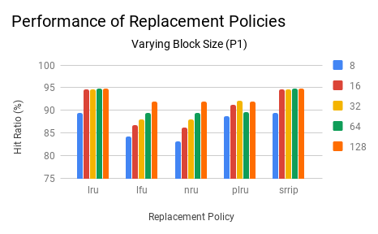
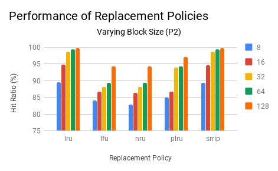
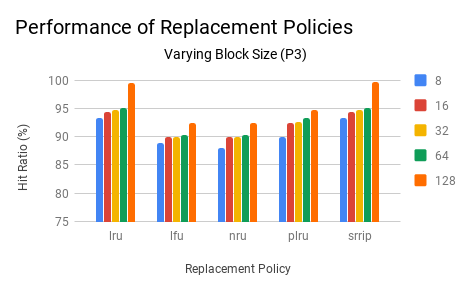
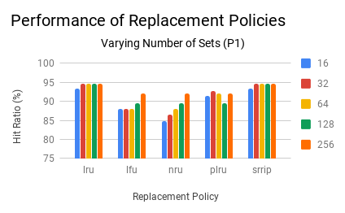
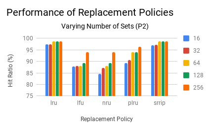
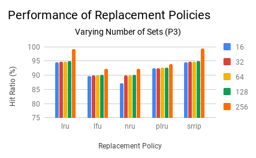
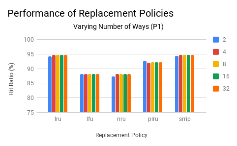
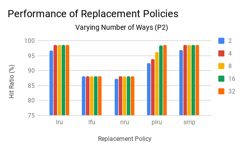
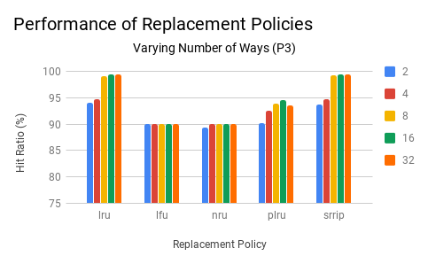
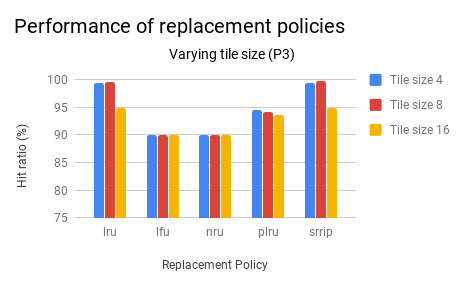

## Analysis of different cache parameters on hit ratio

We have analysed performance of matrix multiplication programs with respect to hit ratio in our one level cache simulator.

For analysis, we considered the following three variants of matrix multiplication:
- P1: DGEMM (Double precision General Matrix Multiply)
- P2: DGEMM with row-major accesses only
- P3: Tiled DGEMM 

We considerd matrices of size 512 X 512 for the above programs. Let A and B be the two matrices to multiply and let C = A* B.

Analysis on hit-ratio is done on the following:
 - [Impact of Block Size](#impact-of-block-size)
 - [Impact of Number of Sets](#impact-of-number-of-sets)
 - [Impact of Set Associativity](#impact-of-set-associativity)
 - [Impact of Tile Size](#impact-of-tile-size)

### Impact of Block Size

Here we have varied block size of cache over values 8, 16, 32, 64 and 128 bytes. The set associativity and number of sets is kept constant at 4 and 64 respectively. 

Following are the results obtained:

All the cache replacement policies do poorly when block size is 8. For a cache with block size 8, just one element from the matrix can is stored on a cache line. In P1, once some element is accessed in A and B, it won't be accessed again soon (accessed again only after completion of inner k loop). So the hit ratio is less. This also explains the drastic increase in hit ratio for all replacement policies when block size is increased from 8 to 16 bytes.

A cache with block size 16 can accomadate 512 double values. This is same as the number of elements in a row of A. Thus, LRU and SRRIP saturate after block size 16 since an entire row of A can be stored when the cache has block sizes greater than 16.

During eviction, LRU and SRRIP mostly remove values pertaining to B over A. This is not true for NRU and LFU, as they might remove values of A even when there are values of B in the same set which will definitely not be used. Thus LRU and SRRIP perfrom vastly better than NRU and LFU. Also as block size increases, per cache line number of hits for NRU and LFU increases, leading to steady increase in hit ratio as block size increases. The same trend is observed in PLRU for the same reasons.

PLRU has an anomoly: sudden decrease in hit ratio for block size 64. We are not sure of the exact reason for this. It might be due to the undeterministic nature of bit-PLRU algorithm.

### Impact of Number of Sets

Here we have varied number of sets in cache over values 16, 32, 64, 128 and 256. The block size and set associativity is kept constant at 32 bytes and 4 respectively.

Following are the results obtained:

### Impact of Set Associativity

Here we have varied set associativity in cache over values 2, 4, 8, 16 and 32. The block size and number of sets is kept constant at 32 bytes and 64 respectively.

Following are the results obtained:

### Impact of Tile Size

Here we have varied tile size in P3 over values 4, 8 and 16 (side of tile). The block size, set associativity and number of sets is kept constant at 32 bytes, 16 and 64 respectively.

Following are the results obtained:

#### Relevant links
1. [Link](https://drive.google.com/drive/folders/1JsXtNrd9Myawke7c2M9BEU8nSjW3ATSR) to traces of the programs.
2. [Link](https://docs.google.com/spreadsheets/d/1dfC8pnfuAcPPloEfE03zAsp8cmzvUKPmlbnhgLS_E7s/edit?usp=sharing) to google sheets with our results.